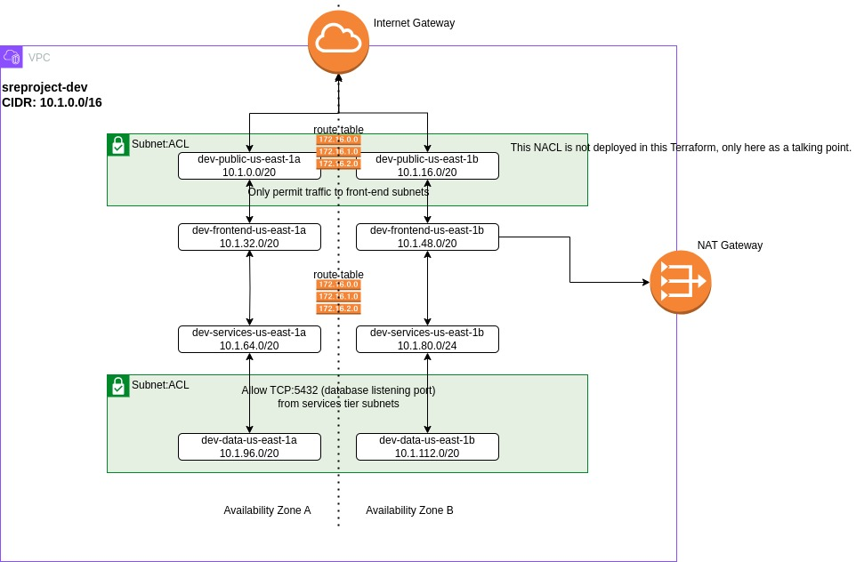

# SRE Project

## Synopsis 

Create a cloud-based VPC to demonstrate networking concepts. You should be able to set up a VPC network in a cloud environment and discuss the various pieces (subnets, routing tables, etc.). Be prepared to explain how this would apply to a production environment.

Acceptance Criteria

- You have set up a VPC in a cloud of your choosing
- Set up is automated with IaC (Terraform Preferred)

Bonus Points

- Multiple instances communicating via VPC

Tech Stack Ideas

- AWS
- GCP
- Terraform

## Solution

### Lifecycle

**DEPLOY**

```
cd tf/env/dev
terraform init
terraform plan  <-- inspect the output for accuracy
terraform apply --auto-approve  <-- we already inspected the output, so no need to prompt for approval to deploy
```

**DESTROY**

```
cd tf/env/dev
terraform destroy
```

### Description

This Terraform uses the root module/child module format. In the **env** folder are root modules for 3 separate environments, prod, qa & dev (we're only deploying dev in this exercise). Values in the resources are abstracted to variables to allow for re-use of the child module(s), e.g. CIDR block, env, vpc-name...



This Terraform will deploy the following infrastructure:

#### VPC

A VPC named as specified in the root module variable **vpc-01-name**. The VPC will have a CIDR block of 10.1.0.0/16, which can be subnetted into multiple blocks, one for each subnet. Sizing of the subnetted blocks depends on the mask assigned in the subnets.tf file, in this case /20.

#### Subnets

8 total subnets will be created:

- 2 public access subnets
- 2 front-end subnets
- 2 services subnets
- 2 data subnets

Public subnets will have routes to the Internet Gateway for 0.0.0.0/0. This subnet is meant to host publicly accessible resources, such as load balancers, or other points of ingress.

Front-end subnets are inteneded to host the companies public facing assets, which are 'fed' from the public subnet load balancers or other gateway-type services.

Services subnets host the business logic and are accessible from the front-end subnets. Services subnets can communicate with the data sources in the data subnets.

Data subnets host data sources and are only accessible from the services subnets by way of Network ACL or other secruity boundry enforcement. In the diagram, only the Postgresql RDBMS defuault TCP port is open in the Network ACL.

#### Route tables

4 route tables are created, one for each set of subnets.

Public-access route table are applied to the public subnets and have a default route set to the Internet Gateway. Typically, these subnets would only host load balancers or API gateways.

Private-access route table is applied to the non-public subnets and have a default route set to the NAT Gateway.

Traffic can be permitted/controlled between the subnets using additional Network ACLs & Security Group (not deployed in this TF code). Additional consideration will need to made if the public subnets host any type of in-bound VPN (better to put that in additional subnets).

#### Internet gateway

To allow inbound access from the Internet.

#### NAT gateway

To allow Internet access for non-public subnets.

#### DHCP Options

As deployed, this sets the hostname & DNS server used by nodes in the infrastructure. The DNS service in AWS subnets is always at x.x.x.2
